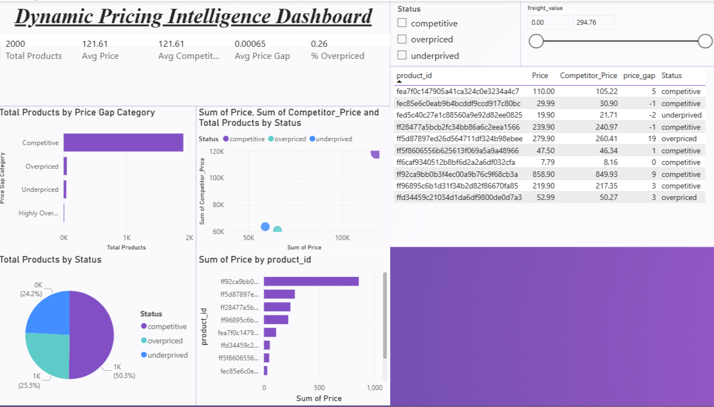

Dynamic pricing analysis using Excel and Power BI to optimize pricing strategy and maximize revenue
# 💰 Dynamic Pricing Dashboard

## 📌 Problem Statement
Analyze how pricing impacts demand, revenue, and competitiveness, and identify optimal pricing strategies.

## 📊 Dataset
- Product pricing dataset
- Includes Price, Competitor Price, Category, Revenue

## 🛠 Tools Used
- Excel (Data Cleaning)
- Power BI (Visualization & Dashboard)

## 🔍 Analysis Performed
- Created price gap and price gap % metrics
- Compared product pricing with competitors
- Identified overpriced and underpriced products
- Built interactive dashboard for decision-making

## 📈 Key Insights
- Average price gap is close to zero → highly competitive pricing
- Some products are overpriced → risk of losing customers
- Some products are underpriced → potential revenue loss
- Price sensitivity varies across categories

## 📊 Dashboard Preview

   

## 🚀 Business Impact
- Helps optimize pricing strategy
- Improves revenue and competitiveness
- Enables data-driven pricing decisions

## 👤 Author
Mayank Kumar  
Data Analyst  

🔗 LinkedIn: https://www.linkedin.com/in/mayank-kumar123/
